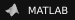

# YIHAO LIU

### Building robots, surgical or otherwise.

<samp>Robotics / AI / Neurosci.</samp>

  

 

## 01 / Profile

Roboticist by training. 

Experienced in real-world and simulated teleoperation, data infrastructure, and robot learning models in production settings. 

With a track record of publications on spatial technologies, including robotics and AR.

 

## 02 / Projects

| Name | Project | Description | Contribution | Stars  |
|---|---|---|---|:---:|
| Feature on NVIDIA CES | [**Moon Surgical × NVIDIA**][moon-video] | Industry work featured during NVIDIA CES. | IsaacSim work |  |
| ⭐ XLeRobot | [**Vector-Wangel/XLeRobot**][xlerobot] | Low-cost dual-arm mobile robot for embodied AI. | Core developer: LeRobot integration, newer gens hardware, SDK | [![Stars][xlerobot-stars]][xlerobot-stargazers] |
| LeRobot Forks | [**bingogome/lerobot**][lerobot] / [**Vector-Wangel/lerobot-xlerobot**][lerobot-xlerobot] | Forks of LeRobot & XLeRobot integration. | Owner / core developer: XLeRobot dev | [![Stars][lerobot-xlerobot-stars]][lerobot-xlerobot-stargazers] [![Stars][lerobot-stars]][lerobot-stargazers] |
| Brainbot | [**bingogome/brainbot**][brainbot] | Modular robot control stack for teleoperation, data collection, AI inference, camera streaming, and visualization. | Owner | [![Stars][brainbot-stars]][brainbot-stargazers] |
| ⭐ SMSL-Imitate | [**SMSL-Project/imitate**][imitate] | Serialized state-machine generation and GenSim training for language-conditioned robot manipulation. | Owner | [![Stars][imitate-stars]][imitate-stargazers] |
| dARt Vinci | [**SMSL-Project/dart-vinci**][dart-vinci] | da Vinci surgical robot across Isaac Sim, Meta Quest 3. | Owner | [![Stars][dart-vinci-stars]][dart-vinci-stargazers] |
| Unity SO-101 | [**SMSL-Project/unity-so101**][unity-so101] | Meta Quest hand-tracking teleoperation for SO-101 robots using Unity and ZMQ. | Contributor | [![Stars][unity-so101-stars]][unity-so101-stargazers] |
| Fantronics Endoscope | [**SMSL-Project/ros1-fantronics-endoscope**][ros1-endoscope] / [**jmz3/EndoscopeCamera**][endoscope-camera] | USB endoscope, ROS Noetic multi-camera raw and compressed streaming. | Contributor | [![Stars][ros1-endoscope-stars]][ros1-endoscope-stargazers] [![Stars][endoscope-camera-stars]][endoscope-camera-stargazers] |
| ⭐ Segment Any Medical Model | [**samm**][samm] | SAM and SAM variants in 3D Slicer. | Owner | [![Stars][samm-stars]][samm-stargazers] |
| Slicer Fast Prototyping Template | [**slicer-fast-proto-template**][slicer-template] | 3D Slicer template for model inference and fine-tuning services. | Owner | [![Stars][slicer-template-stars]][slicer-template-stargazers] |

<!-- Project links -->
[moon-video]: https://www.youtube.com/live/0NBILspM4c4?t=183
[xlerobot]: https://github.com/Vector-Wangel/XLeRobot
[lerobot-xlerobot]: https://github.com/Vector-Wangel/lerobot-xlerobot
[lerobot]: https://github.com/bingogome/lerobot
[brainbot]: https://github.com/bingogome/brainbot
[imitate]: https://github.com/SMSL-Project/imitate
[dart-vinci]: https://github.com/SMSL-Project/dart-vinci
[unity-so101]: https://github.com/SMSL-Project/unity-so101
[ros1-endoscope]: https://github.com/SMSL-Project/ros1-fantronics-endoscope
[endoscope-camera]: https://github.com/jmz3/EndoscopeCamera
[samm]: https://github.com/bingogome/samm
[slicer-template]: https://github.com/bingogome/slicer-fast-proto-template

<!-- Star badges and links -->
[xlerobot-stars]: https://img.shields.io/github/stars/Vector-Wangel/XLeRobot?style=flat-square&logo=github&label=stars&color=111111
[xlerobot-stargazers]: https://github.com/Vector-Wangel/XLeRobot/stargazers
[lerobot-xlerobot-stars]: https://img.shields.io/github/stars/Vector-Wangel/lerobot-xlerobot?style=flat-square&logo=github&label=stars&color=111111
[lerobot-xlerobot-stargazers]: https://github.com/Vector-Wangel/lerobot-xlerobot/stargazers
[lerobot-stars]: https://img.shields.io/github/stars/bingogome/lerobot?style=flat-square&logo=github&label=stars&color=111111
[lerobot-stargazers]: https://github.com/bingogome/lerobot/stargazers
[brainbot-stars]: https://img.shields.io/github/stars/bingogome/brainbot?style=flat-square&logo=github&label=stars&color=111111
[brainbot-stargazers]: https://github.com/bingogome/brainbot/stargazers
[imitate-stars]: https://img.shields.io/github/stars/SMSL-Project/imitate?style=flat-square&logo=github&label=stars&color=111111
[imitate-stargazers]: https://github.com/SMSL-Project/imitate/stargazers
[dart-vinci-stars]: https://img.shields.io/github/stars/SMSL-Project/dart-vinci?style=flat-square&logo=github&label=stars&color=111111
[dart-vinci-stargazers]: https://github.com/SMSL-Project/dart-vinci/stargazers
[unity-so101-stars]: https://img.shields.io/github/stars/SMSL-Project/unity-so101?style=flat-square&logo=github&label=stars&color=111111
[unity-so101-stargazers]: https://github.com/SMSL-Project/unity-so101/stargazers
[ros1-endoscope-stars]: https://img.shields.io/github/stars/SMSL-Project/ros1-fantronics-endoscope?style=flat-square&logo=github&label=stars&color=111111
[ros1-endoscope-stargazers]: https://github.com/SMSL-Project/ros1-fantronics-endoscope/stargazers
[endoscope-camera-stars]: https://img.shields.io/github/stars/jmz3/EndoscopeCamera?style=flat-square&logo=github&label=stars&color=111111
[endoscope-camera-stargazers]: https://github.com/jmz3/EndoscopeCamera/stargazers
[samm-stars]: https://img.shields.io/github/stars/bingogome/samm?style=flat-square&logo=github&label=stars&color=111111
[samm-stargazers]: https://github.com/bingogome/samm/stargazers
[slicer-template-stars]: https://img.shields.io/github/stars/bingogome/slicer-fast-proto-template?style=flat-square&logo=github&label=stars&color=111111
[slicer-template-stargazers]: https://github.com/bingogome/slicer-fast-proto-template/stargazers

 

## 03 / Toolkit

  
  
  
  
  
  
  
  
  
  
  
  
  
  
  
  
  
  
  
  
  
  

 

## 04 / Education

**2021-2025**  
Ph.D. in Computer Science  
Johns Hopkins University

**2025**  
M.S.E. in Computer Science  
Johns Hopkins University

**2019-2021**  
M.S.E. in Robotics  
Johns Hopkins University

**2015-2019**  
B.A.Sc. in Electrical Engineering  
Minor in Computer Science  
University of British Columbia

 

---

  <samp>Robotics / AI / Neurosci.</samp>

